<!-- ╔═════════════════════════════════════════════════════════╗ -->
<!--   NIHAN ANOOP  //  nihan-98716  //  OPERATOR PROFILE     -->
<!-- ╚═════════════════════════════════════════════════════════╝ -->

<!-- ══════════════════ HEADER ══════════════════ -->

<div align="center">


</div>

<!-- Boot sequence typing -->
<div align="center">


</div>

<br/>

<!-- Status badges -->
<div align="center">


&nbsp;

&nbsp;

&nbsp;


</div>

<br/>

<!-- ══════════════════ NEOFETCH BLOCK ══════════════════ -->

<table align="center" border="0" cellspacing="0" cellpadding="0">
<tr>
<td align="center" valign="top" width="220">

<!-- Robot Avatar -->


</td>
<td valign="top" width="32">&nbsp;</td>
<td valign="top">

```
 nihan@sys  ╔══════════════════════════════╗
 ─────────  ║  OPERATOR FILE // CLASSIFIED ║
            ╚══════════════════════════════╝
 OS       ▸ CS + Communications Engineering
 Kernel   ▸ v4.0 LTS  (still updating)
 Host     ▸ Chennai, India  [UTC +05:30]
 Shell    ▸ python3 / gcc / node / bash
 Terminal ▸ VSCode + too many tabs
 CPU      ▸ Overclocked brain™ + caffeine
 RAM      ▸ ████████░░  80%  (AI thoughts)
 Uptime   ▸ Never shutting down

```

</td>
</tr>
</table>

<br/>

<!-- ══════════════════ TECH ARSENAL ══════════════════ -->

<div align="center">


<br/><br/>

<!-- Languages -->
```
$ pkg list --installed --category=languages
```


<br/>

<!-- Frontend / Frameworks -->
```
$ pkg list --installed --category=frameworks
```


<br/>

<!-- Backend / DB / Infra -->
```
$ pkg list --installed --category=backend+infra
```


<br/>

<!-- AI / ML -->
```
$ pip list --ai-stack
```


&nbsp;&nbsp;


<br/>

<!-- Embedded -->
```
$ lsmod | grep embedded
```


&nbsp;&nbsp;


</div>

<br/><br/>

<!-- ══════════════════ ACTIVE DEPLOYMENTS ══════════════════ -->

<div align="center">


</div>

<br/>

```bash
$ git log --oneline --all --author="nihan-98716" --projects
```

<br/>

<div align="center">

| &nbsp; | `repo` | `stack` | `tldr` |
|:---:|:---|:---|:---|
| 🛡️ | **[AEGIS](https://github.com/nihan-98716/AEGIS-Adaptive-Enterprise-Graph-Intelligence-for-Security)** | `GraphSAGE` `SIR` `Monte Carlo` `Python` | Ransomware propagation on Barabási-Albert enterprise graphs + real-time anomaly detection |
| 🤖 | **[BankBot](https://github.com/nihan-98716/Bankbot-AI_Chatbot_For_Banking_FAQs)** | `Python` `Ollama` `ChromaDB` `Streamlit` | Offline-first RAG banking agent — no cloud, no quota drama, strict guardrails |
| 🌿 | **[CASIE AI](https://github.com/nihan-98716/casie-ai)** | `Next.js` `TypeScript` `OCR` `AI` | Carbon emissions auditor — ISO 14064 compliance + auto-report generation |
| 🧠 | **[Cognitive Dijkstra](https://github.com/nihan-98716/Cognitive-Aware-Dijkstra-for-Indoor-Pathfinding)** | `Flask` `Three.js` `Claude API` | Indoor pathfinding with cognitive-load penalties + explainable AI panel |
| 📡 | **[NodeFlux](https://github.com/nihan-98716/NodeFlux)** | `JavaScript` `Docker` `MySQL` | Real-time MySQL cluster monitor — auto-discovers containers in ~10s |
| 💬 | **[Multi-RAG Chatbot](https://github.com/nihan-98716/Multi-Session-RAG-Chatbot-with-PostgreSQL-pgvector)** | `FastAPI` `pgvector` `HuggingFace` `Gemini` | Multi-session isolated RAG — local embeddings, zero cloud quota risk |

</div>

<br/><br/>

<!-- ══════════════════ SYSTEM METRICS ══════════════════ -->

<div align="center">


</div>

<br/>

<div align="center">


&nbsp;&nbsp;


<br/><br/>


</div>

<br/><br/>

<!-- ══════════════════ CONTRIBUTION GRAPH ══════════════════ -->

<div align="center">


</div>

<br/>

<div align="center">


</div>

<br/><br/>

<!-- ══════════════════ TROPHY SHELF ══════════════════ -->

<div align="center">


</div>

<br/>

<!-- ══════════════════ RUNTIME LOGS ══════════════════ -->

<br/>

```bash
$ cat /proc/nihan/runtime.log

  [PROCESS]  UG Thesis       .............. DNA Sequence Pattern Mining w/ ML  🧬
  [PROCESS]  Hackathons      .............. Team Eidos  ⚡  always shipping
  [PROCESS]  IEEE Arc        .............. Core Committee incoming
  [PROCESS]  Interests       .............. Space tech  /  Drones  /  Wasp 3  🛸
  [QUEUE]    Currently       .............. building something that shouldn't work
  [STATUS]   Debug mode      .............. permanently ON

$ echo $MOTTO
  "If it compiles on the first try — that's a threat."

$ uptime
  nihan@sys up ∞ days, caffeine: CRITICAL, commits: always, bugs: educational
```

<br/><br/>

<!-- ══════════════════ CONNECT ══════════════════ -->

<div align="center">


<br/><br/>

<a href="https://www.linkedin.com/in/m-nihan-anoop/">
  
</a>
&nbsp;&nbsp;
<a href="https://github.com/nihan-98716">
  
</a>

<br/><br/>

<!-- Footer -->


<sub><sup>built with ☕ caffeine + 🤖 curiosity + way too many browser tabs &nbsp;//&nbsp; nihan-98716</sup></sub>

</div>

<!-- ╔═══════════════════════════════════════════════════════╗ -->
<!--   end of operator profile  //  nihan@sys ~$             -->
<!-- ╚═══════════════════════════════════════════════════════╝ -->
